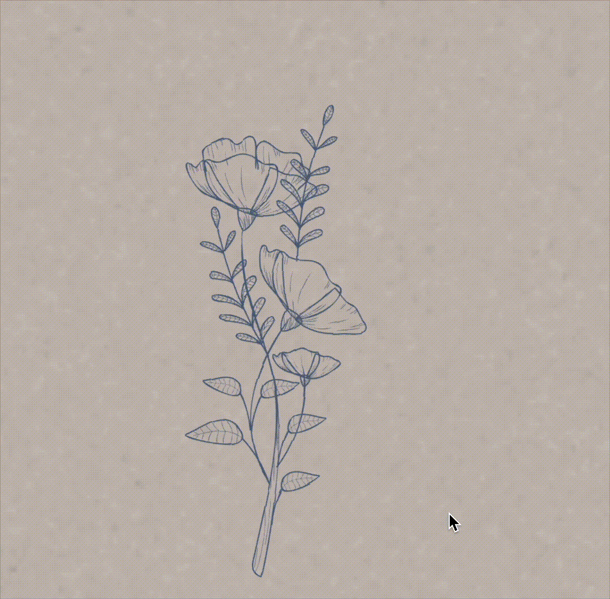

### 🎂 Flowers for Sofia

История создания: делал 3 цветка для поздравления подруги, потом решил посмотреть что есть у других разработчиков и увидел это... Сразу влюился в этот проект и решил его адаптировать (брал его либо толи в CodePen, то ли нашел репозиторий на GitHub уже точно не помню (пишу этот файл сильно позже дня рождения))

Входит в серию проектов "День рождение Софии", все проекты собраны внури тг бота (В данный момент не работает)

---

### 💻 Демонстрация:

---

### 🛠️ Технологии:

---

### 🔮 Будущие планы: 

Планов нету, этот проект уже идеален
